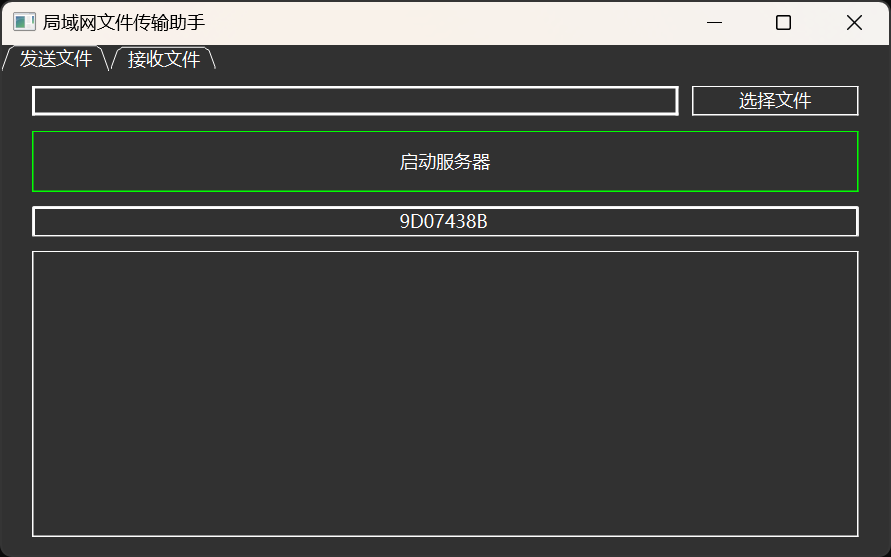

使用方法：
1.应用程序为“打包目录/dist/main.exe”，无任何依赖，可直接使用，或仅下载这一个文件，可自行创建快捷方式
2.第一次使用请在发送文件处点击“启动服务器”以获取接入网络的权限。
3.发送文件方可在"发送文件"栏下选择文件，并启动服务器等待局域网内其他人接收文件。
4.接收文件方可在"接受文件"栏下选择需要保存的目录，并搜索文件，可双击搜索到的文件进行下载。

异常情况：
1.如果接受文件时突然中断，有可能是接收方开启防火墙导致，接收方可关闭防火墙，或者对该工具提供时访问网络权限，也可尝试先在"发送文件"栏下启动服务器获取网络权限后尝试接受。